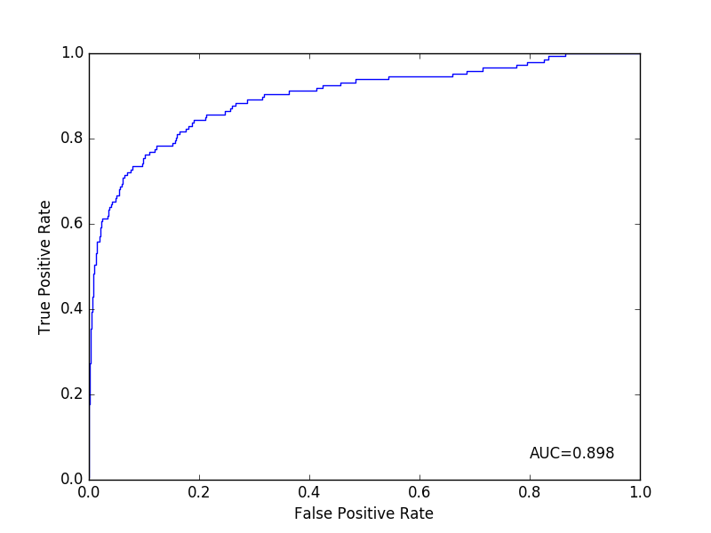
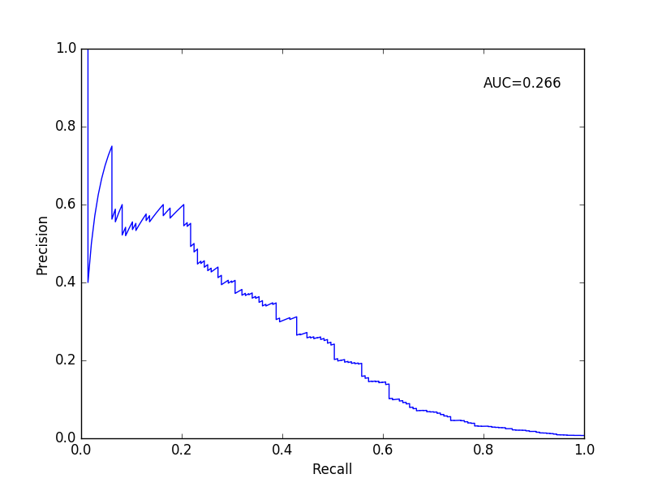

# Hierarchical LSTM model v.s. single LSTM baseline model

These are some preliminary results of a performance comparison. We can already see the edge of our hierarchical LSTM model.

The high AUC under ROC curve and low AUC under PR curve is mainly due to the imbalanced data.

|           | Hierarchical    | Baseline  |
| ----------|:---------------:| ---------:|
| AUC_ROC   | 0.898           | 0.835     |
| AUC_PR    | 0.266           | 0.138     |

## ROC curves (hierarchical model on top)

## Precision-Recall curves (hierarchical model on top)

